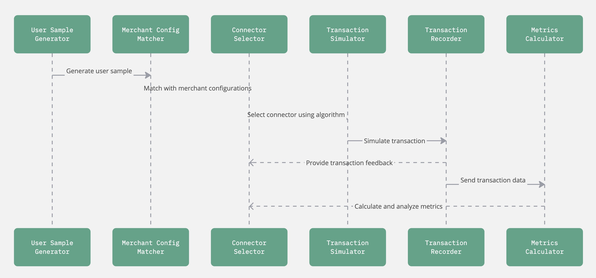

# Testing-framework

## UML Sequence

## Main Workflow Steps

1. **User Sample Generation:**  
   - Generate a user sample using the configuration.
   
2. **Merchant Configuration Matching:**  
   - Match the generated sample with merchant configurations to identify suitable connectors.

3. **Connector Selection (Based on Algorithm):**  
   - Use the routing algorithm (StraightThroughRouting) to select the appropriate connector.

4. **Transaction Simulation with PSP Config:**  
   - Simulate the transaction based on PSP configuration and the generated sample.
5. **Transaction Result Feedback goes to the Algorithm**
   - Transaction outcomes are used to provide feedback to the connector selection algorithm.
   
5. **Recording Transaction Data:**  
   - Send transaction data to the recorder, which writes to CSV and updates metrics.

7. **Metrics Calculation and Analysis:**  
   - Calculate metrics from the recorder data to evaluate the performance of different algorithms.

## Detailed Code Snippets Explanation

### 1. User Sample Generation & Connector Matching
```rust
// Excerpt from main.rs: generate_user_sample function
fn generate_user_sample(config: &Config) -> Result<(String, Vec<Key>)> {
    let output = config.user.generate_sample()?;
    let connectors = find_suitable_connectors(&output, &config.merchant);
    // ...existing code...
}
```
This snippet generates a sample based on user configurations and finds connectors that match merchant settings.

### 2. Transaction Simulation & Recording
```rust
// Excerpt from main.rs: call_script function
match config.psp.call_evaluator(&connector, &user_sample)? {
    Status::Success => {
        // ...existing code...
        let record_data = PaymentRecorderData::set_values(connector.clone(), Status::Success, Key(user_sample.clone()));
        record_data.record_transaction(metrics)?;
    },
    Status::Failure => {
        // ...existing code...
        let record_data = PaymentRecorderData::set_values(connector.clone(), Status::Failure, Key(user_sample.clone()));
        record_data.record_transaction(metrics)?;
    },
}
```
Here the PSP evaluator simulates the transaction outcome, and the result is recorded using the recorder trait.

### 3. Metrics Calculation & Aggregation
```rust
// Excerpt from record.rs: updating metrics data
metrics.key.entry(connector).or_insert_with(HashMap::new)
    .entry(pm).or_insert_with(HashMap::new)
    .entry(pmt).or_insert_with(HashMap::new)
    .entry(verdict).and_modify(|e| *e += 1).or_insert(1);
```
This code maintains a nested map that tracks transaction counts per connector, payment method, and status, allowing later calculation of success rates.

## Data Format in record.csv

The CSV file stores transaction records with the following columns:
1. Connector Name (e.g., stripe, paypal)
2. Transaction Status (e.g., Success, Failure)
3. Payment Method (e.g., card, wallet, bnpl)
4. Payment Method Type (e.g., debit, credit)

Example entry:
```
stripe,Success,card,debit
paypal,Success,card,credit
adyen,Success,bnpl,debit
stripe,Failure,bnpl,debit
```

OutPut:
 ```
Connector: "adyen", Success Rate: 38.46%
Connector: "adyen", Payment Method: "card", Success Rate: 40.00%
Connector: "adyen", Payment Method: "card", Payment Method Type: "credit", Success Rate: 40.00%
Connector: "adyen", Payment Method: "card", Payment Method Type: "debit", Success Rate: 40.00%
Connector: "adyen", Payment Method: "wallet", Success Rate: 37.68%
Connector: "adyen", Payment Method: "wallet", Payment Method Type: "N/A", Success Rate: 37.68%
Connector: "stripe", Success Rate: 100.00%
Connector: "stripe", Payment Method: "card", Success Rate: 100.00%
Connector: "stripe", Payment Method: "card", Payment Method Type: "debit", Success Rate: 100.00%
Connector: "stripe", Payment Method: "card", Payment Method Type: "credit", Success Rate: 100.00%
Connector: "paypal", Success Rate: 35.14%
Connector: "paypal", Payment Method: "bnpl", Success Rate: 31.65%
Connector: "paypal", Payment Method: "bnpl", Payment Method Type: "N/A", Success Rate: 31.65%
Connector: "paypal", Payment Method: "card", Success Rate: 43.75%
Connector: "paypal", Payment Method: "card", Payment Method Type: "debit", Success Rate: 52.38%
Connector: "paypal", Payment Method: "card", Payment Method Type: "credit", Success Rate: 27.27%


Total transactions: 1500
Total transactions from "adyen" connector: 6.93%
Total transactions from "stripe" connector: 85.67%
Total transactions from "paypal" connector: 7.40%
Total Success Rate: 90.93%
 ```

## How to Run

1. Manually edit the iteration count in the main loop in main.rs (e.g., change the `for _ in 0..1500` loop to your desired number of runs).
2. Save your changes.
3. Run the project using:
   ```
   cargo run
   ```

## TODO

- Integrate [hyperswitch-dynamo](https://github.com/juspay/hyperswitch-dynamo)
- Implement feedback loop to algorithm.
- Output format 

    | Label  | Dynamo suggested connector | payment_status | conclusive_classification |
    |--------|----------------------------|---------------|--------------------------|
    | Stripe | Stripe                     | Success       | True Positive           |
    | Stripe | Adyen                      | Success       | False Negative          |
    | Stripe | Stripe                     | Failure       | False Positive          |
    | Stripe | Adyen                      | Failure       | True Negative           |